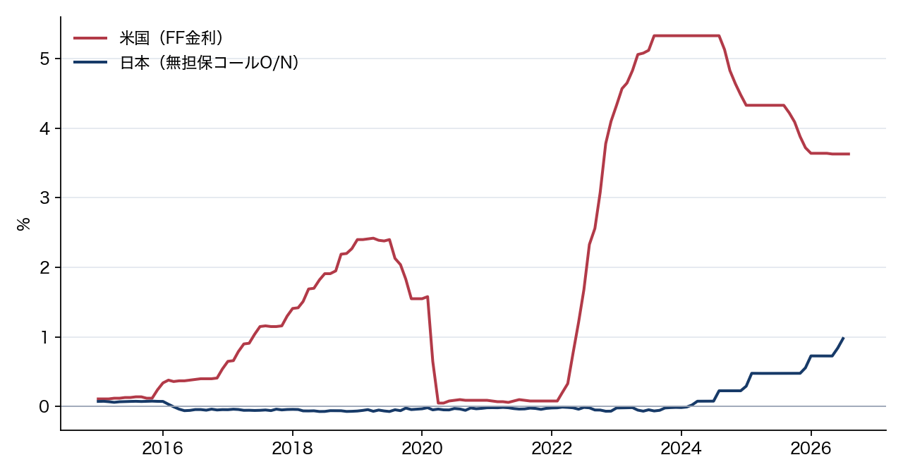

# 比較する系列

- 日本：無担保コール翌日物の月平均です。
- 米国：実効Federal Funds Rateの月平均です。
- 政策の誘導目標そのものではありません。
- 元教材の140か月分を使います。原取得日は未確認です。

# 出所と保存先

| 系列 | 出所 |
|---|---|
| 日本 | 日本銀行「主要時系列統計データ表」FM02 |
| 米国 | FRED `FEDFUNDS` |

入力は `data/policy_rates.csv`、図は `figures/fig01_policy_rates.png` です。

# 月平均金利の推移

{width=90%}

# 米国の数値

- 2022年3月：0.20%です。
- 2023年8月：5.33%です。
- 2026年8月：3.63%です。
- 最初の2時点の差は5.13%ポイントです。

# 日本の数値

- 2016年3月から2024年2月までマイナスでした。
- 2018年6月：−0.071%です。
- 2024年3月：0.022%です。
- 2026年7月：0.978%です。

# 金利差の定義

米国の実効FF金利から、日本のコール翌日物金利を引きます。

sₜ = iₜ(US) − iₜ(JP)

差の単位は%ポイントです。系列の水準の単位と区別します。

# 図と文章の更新

- PythonでCSVを読み、同じpathへ図を保存します。
- 更新後は図の終点と対象期間を確かめます。
- 本文の数字と結論も、更新したCSVと照合します。

# 文書とスライド

`report.md` は説明と記法の見本です。このスライドは `report_slides.md` から作り、長いcodeや記法一覧は文書側で確認します。

図と表を共有しても、スライドの区切りと文章量は出力に合わせて調整します。

# 出典

- 日本銀行：無担保コールレート（翌日物）
- FRED：FEDFUNDS
- 保存済みCSVの再利用です。今回の再取得はありません。
