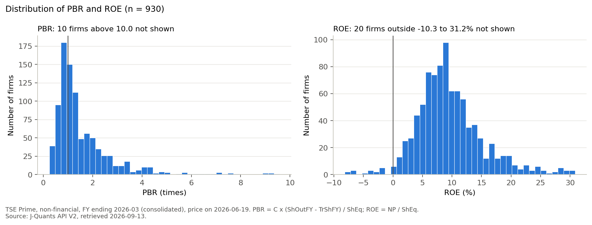
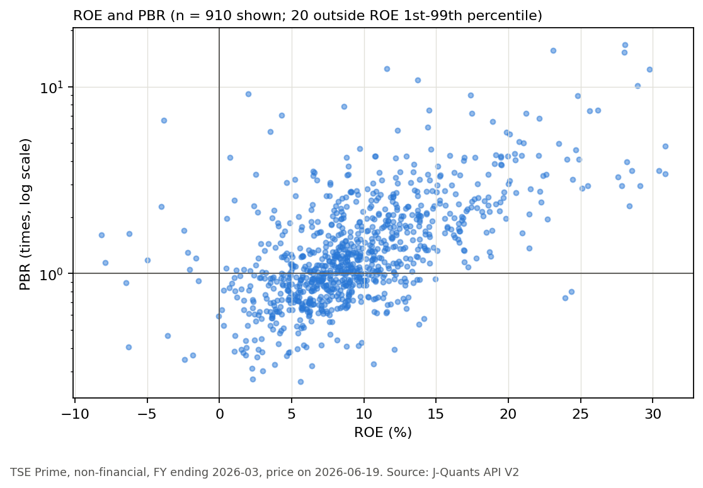

# この回で作るもの

セブン＆アイとイオンの収益性をROE（自己資本利益率）で比べます。次に決算と株価を結び付け、PER（株価収益率）とPBR（株価純資産倍率）の比較を小売業の候補10社に広げます。

作業は、第9回の `financial_analysis/` で進めます。第8回で取得した必要なデータをコピーし、比較表と図を作ります。結果は、このフォルダの `report.md` に一つのレポートとしてまとめます。CSVは再計算用に残し、レポートには単位付きの表、図、読み取り、出所を載せます。

各節で同じ `report.md` の続きを作ります。すでに書いた内容は残し、同じ作業をやり直すときは対応する節を更新します。

# 1. ROEに使う自己資本を集める

ROEは Return on Equity の略で、日本語では「自己資本利益率」です。株主の持分に対して、1年間にどれだけ利益を上げたかを表します。利益には「親会社株主に帰属する当期純利益」、持分には「自己資本」を使います。

連結の純資産には、子会社の他の株主の持分なども含まれます。このため、J-Quantsの純資産 `Eq` と、ROEに使う自己資本は区別します。

1年間の利益を、その期間に使った資本と比べるため、自己資本には期首と期末の平均を使います。

$$
\text{平均自己資本}
= \frac{\text{期首自己資本}+\text{期末自己資本}}{2}
$$

$$
\text{ROE（\%）}
= \frac{\text{親会社株主に帰属する当期純利益}}{\text{平均自己資本}}\times100
$$

2026年2月期の期首には2025年2月末、期末には2026年2月末の残高を使います。前期の比較値が修正されている場合があるので、両方とも2026年2月期の決算短信から確認します。両社の自己資本は、それぞれの2026年2月期決算短信PDFの1ページ目にある「参考：自己資本」に載っています。

```text
セブン＆アイとイオンの2026年2月期決算短信を公式サイトで探し、ROEの計算用の表を作って。
営業収益、親会社株主の純利益、期首・期末の総資産と自己資本を、同じ単位でまとめて。
両社とも金融事業を含むグループ全体の値を使い、取得済みデータと照合して。
表を data/comparison_inputs.csv に保存して。
report.md を作り、対象会社・期間・入力表・出所のPDFページ・取得済みデータとの違いをまとめて。
```

`report.md` で入力表と出所を確認します。再計算用の `data/comparison_inputs.csv` は1社につき1行です。次の数値は、決算短信から確認した参照値です。単位は百万円です。

| 項目 | セブン＆アイ | イオン |
|---|---:|---:|
| 営業収益 | 10,430,269 | 10,715,342 |
| 親会社株主に帰属する当期純利益 | 292,760 | 72,677 |
| 期首総資産 | 11,386,111 | 13,833,319 |
| 期末総資産 | 9,142,957 | 15,369,658 |
| 期首自己資本 | 4,035,978 | 1,063,275 |
| 期末自己資本 | 3,620,226 | 1,218,421 |

出所：[セブン＆アイの決算短信](https://www.7andi.com/ir/file/library/kt/pdf/2026_0409kt.pdf)、[イオンの決算短信](https://www2.jpx.co.jp/disc/82670/140120260408599944.pdf)。いずれも2026年4月9日公表、PDF1ページです。

# 2. ROEを三つに分ける

ROEは、利益率、資産の使い方、資本の構成に分けて読むことができます。この分け方をデュポン分解と呼びます。

架空の会社で、売上高が1,000、純利益が40、平均総資産が800、平均自己資本が400とします。金額はすべて同じ単位です。

| 指標 | 計算 | この会社の値 | 意味 |
|---|---|---:|---|
| 売上高純利益率 | 純利益÷売上高 | 4% | 売上のうち利益として残る割合 |
| 総資産回転率 | 売上高÷平均総資産 | 1.25回 | 資産の規模に対して上げた売上 |
| 財務レバレッジ | 平均総資産÷平均自己資本 | 2倍 | 自己資本に対する資産の倍率 |

$$
\text{ROE}
=\frac{\text{純利益}}{\text{売上高}}
\times\frac{\text{売上高}}{\text{平均総資産}}
\times\frac{\text{平均総資産}}{\text{平均自己資本}}
$$

売上高と平均総資産が約分され、純利益÷平均自己資本が残ります。この会社では、0.04×1.25×2＝0.10なので、ROEは10%です。

今回の2社では、売上高に相当する値として営業収益を使います。総資産も、自己資本と同じく期首・期末の平均を使います。

```text
data/comparison_inputs.csv から、2社のROEとデュポン分解の3要素を計算して。
ROEを直接計算した値と、3要素の積が一致するかも確認して。
必要な値が欠けている場合や分母が正でない場合は、空欄にして理由を残して。
結果を data/company_comparison.csv に保存して。
ROEと3要素をそれぞれ単位付きの棒グラフにし、figures/profitability_comparison.png に保存して。
report.md に「2社の収益性」の節を加え、表とグラフ、短い説明、確認結果をまとめて。
```

第1節の参照値から計算すると、次のようになります。利益率とROEは%、回転率は回、レバレッジは倍で表示しています。

| 指標 | セブン＆アイ | イオン |
|---|---:|---:|
| 売上高純利益率 | 2.81% | 0.68% |
| 総資産回転率 | 1.02回 | 0.73回 |
| 財務レバレッジ | 2.68倍 | 12.80倍 |
| ROE | 7.65% | 6.37% |

セブン＆アイは利益率と回転率が高く、イオンはレバレッジが高くなっています。ROEだけを見るよりも、稼ぎ方の違いが分かります。表示値は丸めているため、積がROEと少しずれることがあります。

# 3. 図の違いを読み、決算短信で理由を探す

ROEと三つの要素を図にすると、どこに大きな差があるかを見比べやすくなります。

```text
report.md の「2社の収益性」にあるグラフから、2社の違いを読み取って。
違いの背景を決算短信の事業内容、財政状態、キャッシュ・フローの説明から調べて。
読み取れたことを根拠のPDFページとともに、report.md の「2社の収益性」に追記して。
```

同じ小売業でも、金融事業などの組み合わせは違います。また、子会社が連結から外れると、資産の規模も変わります。図の差と決算短信の説明を合わせて読むと、事業の違いが見えてきます。

負債やお金の出入りも見ると、収益性と資金面の両方から比較できます。

# 4. 比較を広げるときの考え方

同じ会社の別の年度を並べると、時間を通じた変化が分かります。同じ年度の別の会社を並べると、会社間の違いが分かります。

別の年度のROEを計算する場合も、期首と期末の自己資本を使います。例えば2025年2月期には、2024年2月末と2025年2月末の残高が必要です。

ここからは株価も取得し、PERとPBRで会社を比べます。

# 5. 比較する日を固定する

株価は毎日変わるので、評価日を2026年6月30日にそろえます。

| 項目 | 今回の条件 |
|---|---|
| 株価 | 2026年6月30日の終値 |
| 決算 | 各社の最新の通期・連結実績 |
| 開示 | 評価日の取引終了（15時30分）より前に公表されたもの |
| 銘柄一覧 | 評価日時点のもの |

各社の決算期と開示日を表に併記します。

# 6. 銘柄一覧と株価を取得する

会社名や業種、決算、株価は、別々の表として取得します。取得方法はCodexに任せます。

前にも説明したように、API（Application Programming Interface）は、プログラムからデータを受け取る窓口です。取得した表は、CSV（Comma-Separated Values）という、値をカンマで区切る形式で保存します。

```text
セブン＆アイとイオンについて、J-Quantsから2026年6月30日時点の銘柄情報と当日の株価を取得して。
決算には、評価日の取引終了前までに公表された最新の通期・連結実績を使って。
元データを raw/ に保存し、銘柄情報・決算・株価をそれぞれCSVにして。
取得条件と結果を report.md の「株価と決算の比較」にまとめて。
```

株価は、評価日に付いた調整前終値 `C` を使います。各表に同じ2社があるか、日付が今回の条件に合っているかを確認します。

# 7. 銘柄コードで表を結ぶ

銘柄コード `Code` が同じ行を横につなぐと、会社名・決算・株価を一つの表にできます。会社名には表記の違いがあるので、コードを使います。

```text
銘柄情報・決算・株価のCSVを、銘柄コードで結合して。
1社1行の表を data/company_table.csv に保存して。
決算や株価が不足する会社も残して。
report.md の「株価と決算の比較」に表を載せ、不足した項目と理由もまとめて。
```

`report.md` の表で、2社が1行ずつ並んでいるかを見ます。1社が複数行になる場合は、別の年度などが混ざっている可能性があります。原因の確認と修正もCodexに任せられます。

# 8. 1株当たりの数値と価格を比べる

## EPSとBPS

1株の価格と比べるために、利益と自己資本も1株当たりにそろえます。

| 略語 | 英語の正式名称 | 意味 |
|---|---|---|
| EPS | Earnings per Share | 1株当たりの純利益。計算には期中平均の株式数を使います。 |
| BPS | Book-value per Share | 1株当たりの自己資本。計算には期末の株式数を使います。 |

どちらの株式数も自己株式を除きます。決算短信ではBPSは「1株当たり純資産」と書かれています。今回はJ-Quantsの実績 `EPS` と `BPS` を使います。

## PERとPBR

PERは Price Earnings Ratio の略で、「株価収益率」です。株価が1株当たり利益の何倍かを表します。

PBRは Price Book-value Ratio の略で、「株価純資産倍率」です。株価が1株当たり自己資本の何倍かを表します。

$$
\text{PER（倍）} = \frac{\text{株価}}{\text{実績EPS}}
$$

$$
\text{PBR（倍）} = \frac{\text{株価}}{\text{BPS}}
$$

例えば、株価が2,000円、EPSが100円、BPSが1,000円なら、PERは20倍、PBRは2倍です。

PER20倍は、その年の利益の20倍の価格が付いているという意味です。

## 理論上のPER・PBRは何倍になるか

理論上の倍率は、将来の利益と投資家の要求収益率によって決まります。要求収益率は、投資家がその株式のリスクに見合うとして求める収益率です。

毎年の利益が一定で、その全額を配当し続けるモデルを考えます。要求収益率を $r$ とすると、株価は毎年の配当を割り引いた現在価値なので、次のようになります。

$$
\text{株価} = \frac{\text{EPS}}{r}, \qquad
\text{PER} = \frac{1}{r}
$$

要求収益率が5%なら、理論上のPERは $1/0.05=20$ 倍です。EPSが100円なら、株価は2,000円になります。

このモデルでは、利益を全額配当するので、自己資本は一定です。1株当たりの自己資本がBPSなので、毎年の利益は $\text{EPS}=\text{ROE}\times\text{BPS}$ と書けます。これを株価の式に代入すると、次の関係になります。

$$
\text{PBR}
= \frac{\text{株価}}{\text{BPS}}
= \frac{\text{EPS}/r}{\text{BPS}}
= \frac{\text{ROE}}{r}
$$

ROEが要求収益率 $r$ と同じなら、分子と分母が等しくなるのでPBRは1倍です。

| 今後のROE | 理論上のPBR |
|---|---|
| 要求収益率と同じ | 1倍 |
| 要求収益率より高い | 1倍より高い |
| 要求収益率より低い | 1倍より低い |

例えば、BPSが1,000円でROEが5%なら、毎年の利益と配当は1株当たり50円です。要求収益率も5%なら、この配当の現在価値は $50/0.05=1,000$ 円になります。株価とBPSが一致するため、PBRは1倍です。

同じ要求収益率でROEが10%なら、毎年の配当は100円、株価は2,000円、PBRは2倍になります。後半のROEとPBRの散布図も、この関係を考える材料になります。

## 株式分割と計算条件

1株を2株に分割すると、同じ価値を2株に分けることになります。株価とEPS・BPSを同じ株数の基準にそろえれば、倍率は変わりません。決算短信に分割後の値が載っている場合もあるので、調整が必要かを確認します。

この比較では、株数の基準を確認でき、株価と分母が正で、必要な値がそろった指標だけを計算します。赤字の会社はPERが空欄になりますが、BPSが正ならPBRは計算できます。

```text
2社の実績EPS・BPSと評価日の株価について、株式分割などを踏まえて株数の基準をそろえて。
確認した根拠と調整内容を report.md の「株価と決算の比較」に書いて。
実績PERとPBRを計算し、data/company_table.csv に加えて。
report.md の比較表に倍率を加え、計算できない指標は空欄として理由を残して。
```

表では、株価・EPS・BPSと、計算した倍率を見比べます。低い倍率だけで割安とは判断できず、将来の利益や事業の見通しも関係します。

# 9. 同じ手順を候補10社に広げる

評価日のプライム市場・小売業から、最初の2社と、残りを銘柄コード順に8社選びます。各社の最新の通期決算を使うので、2月決算以外の会社も比較できます。

```text
評価日のプライム市場・小売業から、セブン＆アイとイオンが条件に合うことを確認し、他の8社を銘柄コード順に選んで。
候補を保存し、J-Quantsから各社の決算データと株価を取得して、実績PERとPBRを計算して。
決算期は固定せず、2026年6月30日の15時30分より前に公表された各社の最新の通期・連結実績を選んで。
各社の決算開始日・期末・開示日を表に載せて。
条件に合わない会社は入れ替えず、data/company_table.csv を更新して。
report.md の比較表を10社に広げ、計算できた社数とできなかった理由をまとめて。
```

取得対象を増やしても、同じプログラムで表を作れます。`report.md` では、候補社数、決算・株価がそろった社数、PER・PBRを計算できた社数を確認します。

# 10. 図を作り、目立つ値を元の資料で読む

各社のPBRを図にして、値の違いを見ます。大きく離れた値があれば、計算に使った株価とBPSに戻って調べます。

```text
各社のPBRの比較図を figures/pbr_comparison.png に保存して。
評価日・決算期・計算できた社数を添え、PERとPBRの平均・中央値も表示して。
PBRが最も高い会社と低い会社について、元データと決算短信を確認して。
図・平均・中央値と読み取れたことを、出所とともに report.md の「株価と決算の比較」にまとめて。
```

平均は、一つの大きな値に影響されます。中央値と計算に使った社数も並べると、どの範囲の結果かが分かります。

# 11. 多数の企業の実データをプロットする

プライム市場の非金融企業に広げると、会社ごとの差を一つの図で見られます。次は、J-Quantsから取得した930社の作例です。

## 間隔を空けて取得する

会社ごとに問い合わせると、取得回数が多くなります。この作例では、銘柄一覧と株価を日付指定でまとめて取り、決算は開示日ごとに取得しました。

2026年9月13日に取得した際は、問い合わせの間隔を13秒空けました。全体で約50回、10分余りの取得です。日ごとに保存するため、途中で止まっても保存済みの分を使って再開できます。再取得するときの間隔や取得可能期間は、Codexが公式仕様を確認します。

## 930社の分布と散布図

保存した作例は、2026年3月期の連結通期決算と、2026年6月19日の株価を使っています。無料プランで取得できる範囲に合わせた日付です。

| データをそろえる段階 | 社数 |
|---|---:|
| プライム市場 | 1,563 |
| 対象の決算と株価がそろう | 1,041 |
| 金融業を除く | 933 |
| 必要な値がそろう | 931 |
| 分母などの条件を満たす | 930 |

この作例のROEは「純利益÷期末自己資本」です。第2節で使った期首・期末の平均とは異なります。PBRは「株価×自己株式を除く期末株式数÷期末自己資本」で求めています。



PBRの中央値は約1.18倍、ROEの中央値は8.78%でした。PBRが1倍未満の企業は356社です。ヒストグラムでは、どの範囲に会社が集まっているかを見ます。



散布図の縦軸は対数です。上に行くほどPBRが高く、同じ倍率の変化が同じ間隔になります。ROEとPBRの関係を見ながら、同じROEでもPBRに幅があることを確かめられます。

図を読みやすくするため、一部の極端な値は表示範囲から外しています。社数や中央値は930社全体から求めています。[社数の記録](example/tables/sample_counts_2026.csv)と[業種別の集計](example/tables/industry_medians_s17.csv)でも確認できます。

## Codexに取得と作図を頼む

Codexに取得・計算・作図のプログラムを作ってもらいます。

```text
プライム市場の非金融企業について、J-Quantsから2026年3月期の連結通期実績と2026年6月19日の銘柄情報・株価を取得するプログラムを作って実行して。
決算は2026年4月15日から評価日の取引終了前までの開示を日付ごとに取得し、各社の最新の実績を選んで。
無料プランの公式仕様を確認し、間隔を空けて取得・保存し、途中から再開できるようにして。
上記の計算方法でROEとPBRを求め、それぞれの分布と、横軸ROE・縦軸PBRの散布図を作って。
プログラム・データ・図を prime_comparison/ に保存して。
report.md に「多数企業の比較」の節を加え、図・対象社数・除外理由・計算条件・読み取りをまとめて。
```

取得時点によってデータが更新されることがあるので、再実行後の社数や数値も記録します。

# 参考資料

- 桜井久勝『財務諸表分析』第9版、中央経済社。比較の考え方は第7章、ROE・平均残高・デュポン分解は第8章（169〜172頁、181〜184頁）、PER・PBRは第14章（301頁）を参照しています。頁は書籍の印刷頁です。
- J-Quants API V2：[財務情報](https://jpx-jquants.com/ja/spec/fin-summary)、[銘柄一覧](https://jpx-jquants.com/ja/spec/eq-master)、[株価](https://jpx-jquants.com/ja/spec/eq-bars-daily)。取得の細部はCodexが公式仕様を確認します。
- [セブン＆アイの2026年2月期決算短信](https://www.7andi.com/ir/file/library/kt/pdf/2026_0409kt.pdf)、[イオンの2026年2月期決算短信](https://www2.jpx.co.jp/disc/82670/140120260408599944.pdf)。ともに2026年4月9日公表です。
