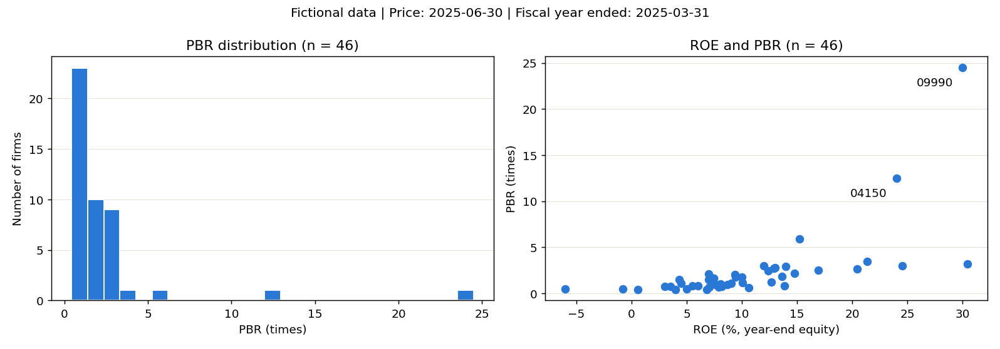
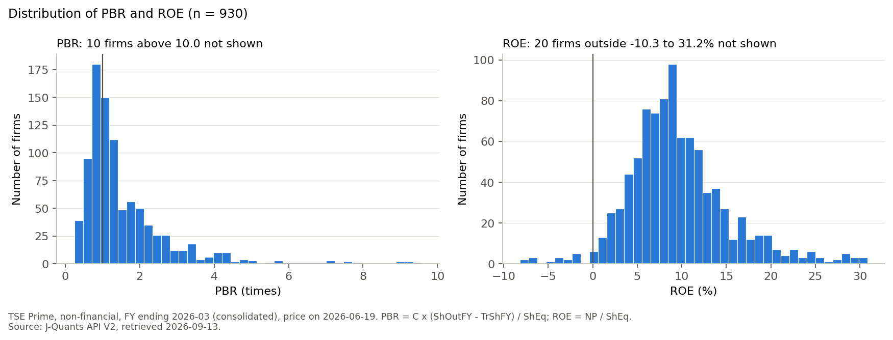
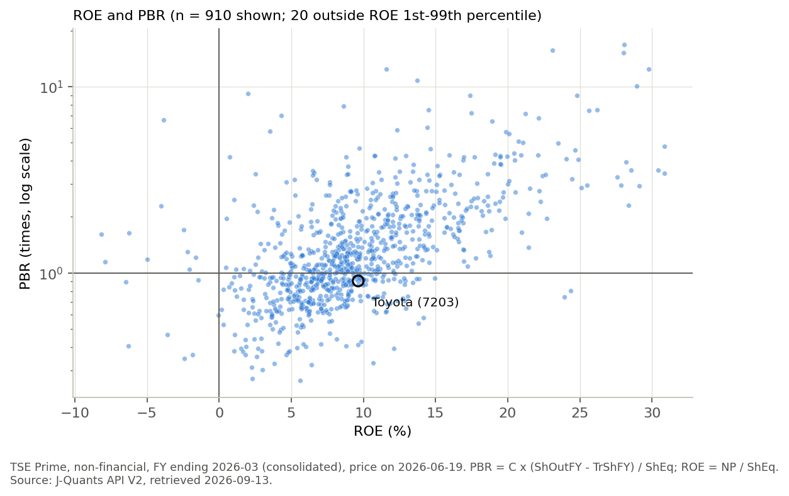

# この回で作るもの

収益性の高い会社は、株式市場でも高く評価されているのでしょうか。ROEとPBRを複数の会社について計算し、業種ごとの違いと、会社ごとのばらつきを調べます。

そのためには、会社名や業種、決算の数値、株価を1つの表にまとめる必要があります。最初から同じ表に入っているわけではないので、銘柄コードで結びます。出来上がるのは、比較に使った社数の表、業種別の集計表、PBRの分布とROEとの散布図です。

作業は、比較の条件を決めるところから始めます。次に、3つの表を1社1行にそろえて結合し、計算に使う会社を選びます。その表から指標と図を作り、目立つ値を元のデータに戻って確かめます。

本文では主に架空のデータを使います。計算を試すときは、補助の [workbook.py](workbook/workbook.py) をCodexに渡し、実行や条件の変更を頼めます。実際のデータを使いたい場合は、一番最後を見てください。

# 1. 比較する日と会社を決める

株価は日々変わり、決算も会社によって対象期間が違います。異なる時点の数値を混ぜないよう、今回の比較では次の条件を使います。

| 決めること | 今回の条件 |
|---|---|
| 株価を比べる日（評価日） | 2025年6月30日 |
| 決算の対象 | 2025年3月期の通期決算 |
| 利用できる情報 | 評価日までに開示された決算 |
| 会社の範囲 | プライム市場の非金融企業 |
| 指標を計算するための条件 | 純利益と自己資本があり、自己資本が正で、評価日の株価があること |

金融業を除くのは、財務構造が異なる会社を同じ指標で比べる範囲を絞るためです。

使うファイルは `workbook/data/` にあります。架空のデータです。今回の中心になるのは次の3つです。

| 表 | 入っている情報 | 読み込んだ時点の行数 |
|---|---|---:|
| `master.csv` | 銘柄コード、会社名、業種、市場区分 | 67 |
| `fins.csv` | 開示日、決算期、純利益、自己資本、株数など | 147 |
| `daily_2025-06-30.csv` | 評価日の銘柄別株価 | 67 |

3つの表は、J-Quantsから取れる実データを小さくした形です。`master.csv` は評価日の上場銘柄一覧、`daily_2025-06-30.csv` は評価日の全銘柄の株価で、どちらも列を絞っています。`fins.csv` は決算短信のサマリーを開示日ごとに取り、決算発表の期間分をつないで12列に絞ったものです。実データでは数値が文字列で届くので、数に変換してから使います。列名は実データと同じです。業種ごとのPBRとROEの中心や決算発表の日の集まり方も、実データに近づけてあります。

行数は社数とは限りません。銘柄の表には同じ行の重複があり、決算の表には同じ会社の複数年の決算や訂正開示が入っています。まず、各表の1行が何を表すかをそろえます。

# 2. 各表を1社1行にそろえる

## 銘柄コードを同じ形で扱う

3つの表を結ぶ目印は `Code` です。例えば `01110` を数として読むと、先頭の0が消えて `1110` になります。銘柄コードは計算に使う量ではないので、文字列として読みます。日付は前後関係で選べるよう、日付型にします。

```python
master = pd.read_csv("data/master.csv", dtype={"Code": str})
fins = pd.read_csv("data/fins.csv", dtype={"Code": str}, parse_dates=["DiscDate", "CurPerEn"])
daily = pd.read_csv("data/daily_2025-06-30.csv", dtype={"Code": str}, parse_dates=["Date"])
```

銘柄の表では、`03330` のリテールCが同じ内容で2回入っています。同じ行を1つにすると、67行から66社の表になります。この重複は練習のために入れたもので、J-Quantsから1日分の銘柄一覧を取ったときには起きません。複数の日の一覧をつなぐと、同じ会社が日数分並びます。内容が異なる2行なら、単に片方を消すのではなく、どちらが今回の条件に合うかを調べます。

## 使う決算を選ぶ

決算の表では、銘柄コードだけで重複を消せません。同じ会社でも、前期と当期、四半期と通期では数値の意味が違うからです。次の順で使う行を決めます。

1. 2025年3月期の通期決算を残します。
2. 業績予想だけを修正した行を除き、決算の実績が載る行を残します。
3. 2025年6月30日までに開示された行を残します。
4. 同じ会社の訂正開示があれば、その範囲内で最後の開示を使います。

これをコードで表すと、次の処理です。最初の部分で条件に合う行を選び、最後の行で1社1行にします。

```python
fy = fins[(fins["CurPerType"] == "FY")
          & fins["DocType"].str.startswith("FYFinancialStatements")
          & (fins["CurPerEn"] == "2025-03-31")
          & (fins["DiscDate"] <= "2025-06-30")]
fy = fy.sort_values(["Code", "DiscDate"]).drop_duplicates("Code", keep="last")
```

ここでの `&` は「かつ」です。複数の条件を同時に満たす行だけを残しています。

架空企業リテールE（`05550`）では、最初の開示と訂正後の開示で、次のように数値が変わっています。

| 開示日 | 純利益（円） | 自己資本（円） | 今回の扱い |
|---|---:|---:|---|
| 2025年5月14日 | 9,000,000,000 | 60,000,000,000 | 訂正前 |
| 2025年5月28日 | 7,200,000,000 | 58,200,000,000 | この行を使用 |

一方、ネットH（`08880`）の決算開示は7月10日です。評価日の6月30日にはまだ公表されていないため、今回の比較には使いません。食品C（`08950`）の訂正開示も7月15日なので、評価日には最初の開示を使います。

サービスE（`06790`）と化学D（`09140`）は12月決算です。2025年3月31日に終わる期の行はありますが、第1四半期の決算なので、通期の条件で外れます。

この選び方では、決算147行のうち条件に合う行が66行残り、訂正前の行を除くと64社になります。銘柄の表は66社なので、社数も顔ぶれも一致しません。決算の表には銘柄の表にない `07890` があり、銘柄の表にはネットHと12月決算の2社のように、使える決算のない会社があります。

# 3. 銘柄・決算・株価を結ぶ

会社名と業種のある銘柄の表を出発点にし、同じ銘柄コードの決算を横に付けます。続いて、評価日の株価を付けます。

```python
master_u = master.drop_duplicates()
panel = master_u.merge(fy, on="Code", how="left", validate="one_to_one")
panel = panel.merge(daily[["Code", "C"]], on="Code", how="left", validate="one_to_one")
```

`merge` が表を結ぶ処理です。`left` は出発点の会社をすべて残す指定です。相手が見つからない場合も会社の行を残し、付けられなかった数値を欠損にします。`one_to_one` は、どちらの表も1社1行であることを確かめる指定です。

小さな表で試すと、違いが見えます。左の表 `names` には会社名、右の表 `profit` には純利益（億円）が入っています。

```python
names = pd.DataFrame({"Code": ["01110", "03330", "08880"],
                      "CoName": ["オートA", "リテールC", "ネットH"]})
profit = pd.DataFrame({"Code": ["01110", "03330", "07890"],
                       "NP": [88.2, 12.75, 25.0]})
```

:::: {.columns}
::: {.column}
左の表 `names`

| Code | CoName |
|---|---|
| 01110 | オートA |
| 03330 | リテールC |
| 08880 | ネットH |
:::
::: {.column}
右の表 `profit`

| Code | NP |
|---|---:|
| 01110 | 88.2 |
| 03330 | 12.75 |
| 07890 | 25.0 |
:::
::::

`01110` と `03330` は両方の表にあります。`08880` は左だけ、`07890` は右だけにあります。

```python
names.merge(profit, on="Code", how="left")
names.merge(profit, on="Code", how="inner")
```

:::: {.columns}
::: {.column}
`how="left"` の結果

| Code | CoName | NP |
|---|---|---:|
| 01110 | オートA | 88.2 |
| 03330 | リテールC | 12.75 |
| 08880 | ネットH | NaN |
:::
::: {.column}
`how="inner"` の結果

| Code | CoName | NP |
|---|---|---:|
| 01110 | オートA | 88.2 |
| 03330 | リテールC | 12.75 |
:::
::::

`left` では左の3社がすべて残り、相手のないネットHの `NP` が欠損（`NaN`）になります。`inner` では両方にある2社だけが残り、ネットHの行そのものが消えます。右にしかない `07890` は、どちらの方法でも入りません。

この例では、銘柄の表66社に決算と株価を付けても、66行のままです。ネットHと12月決算の2社は使える決算がないので、その列が欠損になります。決算と株価にある `07890` は銘柄の表にないため、この表には入りません。

`inner` に変えると、決算を結んだ時点で63社になります。ネットHと12月決算の2社が、行ごと消えるからです。

結合後に行数が増えた場合は、同じコードが複数行ある可能性があります。例えば、3社×3日で9行ある株価に、リテールCが重複したままの銘柄の表を付けると、12行になります。1社の数値が余分に数えられるため、集計前に重複を解消します。

## Codexに頼む

ここまでの作業は、次のように頼めます。

```text
workbook/dataの3つのCSVを、Codeは文字列、日付は日付型で読んで。
2025年3月期の通期決算のうち、2025年6月30日までに開示された実績の行を選び、訂正があれば最後の開示を使って1社1行にして。
銘柄の表の重複を除いて決算と評価日の株価を付け、各段階の行数と、決算や株価が付かなかった会社を表示して。
```

# 4. 比較に使う会社を選び、PBRとROEを作る

## 条件を加えるたびに社数を残す

結合した66社に、最初に決めた条件を1つずつ加えます。途中の社数を残すと、最後の46社がどう選ばれたかを説明できます。

| 段階 | 社数 | この段階で外れる会社 |
|---|---:|---|
| 銘柄の表を重複なしにする | 66 | 同じ内容の重複行を除去 |
| 決算を結ぶ（left） | 66 | なし。見つからない決算は欠損 |
| 評価日の株価を結ぶ（left） | 66 | なし。株価の欠損も残す |
| プライム市場に絞る | 56 | リテールFなどスタンダード市場の7社、グロース市場の3社 |
| 金融業を除く | 51 | 銀行K・銀行A・銀行B、証券A、保険A |
| 純利益と自己資本がある会社に絞る | 48 | 評価日までに決算のないネットH、12月決算のサービスE・化学D |
| 自己資本が正の会社に絞る | 47 | 自己資本が負のネットG |
| 評価日の株価がある会社に絞る | 46 | 株価が欠損している電力P |

赤字のオートD（`04440`）と化学C（`07580`）は残ります。純利益が負でも、自己資本が正なら、ROEは赤字を表す負の値として読めます。

ネットG（`07770`）は純利益も自己資本も負なので、割り算するとROEが正の50%になります。これを高い収益性と読むことはできません。自己資本の条件を付けるのは、このような比較を避けるためです。

## 同じ定義で全社を計算する

今回のROEは、期末の自己資本を分母にします。株数は、発行済株式数から自己株式を引いた数を使います。

$$
\text{時価総額}=\text{評価日の終値}\times(\text{発行済株式数}-\text{自己株式数})
$$

$$
\text{PBR}=\frac{\text{時価総額}}{\text{自己資本}},\qquad
\text{ROE}=\frac{\text{親会社株主に帰属する当期純利益}}{\text{期末の自己資本}}
$$

データの `C` は終値、`NP` は純利益、`ShEq` は自己資本です。`ShOutFY` と `TrShFY` は、それぞれ期末の発行済株式数と自己株式数です。円・株で単位がそろっているので、次の計算を列全体に行えます。

```python
panel["Shares"] = panel["ShOutFY"] - panel["TrShFY"]
panel["MV"] = panel["C"] * panel["Shares"]
panel["PBR"] = panel["MV"] / panel["ShEq"]
panel["ROE"] = panel["NP"] / panel["ShEq"]
```

ROEの0.09は9%です。表示するときに100倍します。ここでは期末株数を使うため、実データに広げる際は、期末から評価日までの株式分割や自己株式の取得なども確認します。

株価がない電力PのPBRは計算できません。欠損を0にすると、「PBRが0倍の会社」に変わってしまいます。この例では、欠損を除いたPBRの中央値は約1.34倍ですが、0で埋めると約1.20倍に下がります。欠損はそのまま残し、計算に使えなかった社数を記録します。

社数の表とPBR・ROEの計算は、結合した表の続きとして頼めます。

```text
この表に1節の条件を1つずつ加え、段階ごとの社数と外れた会社を表にして。
残った会社のPBRとROEを計算して。株数は発行済株式数から自己株式数を引いた数にして。
```

# 5. 業種ごとに比べる

1社1行の表ができたら、業種ごとに分けてPBRとROEを集計します。平均だけでなく中央値も出し、何社から計算した値かを並べます。

| 業種 | 社数 | PBR平均（倍） | PBR中央値（倍） | ROE中央値（%） |
|---|---:|---:|---:|---:|
| 情報・通信業 | 8 | 5.402 | 2.355 | 13.4 |
| 電気機器 | 6 | 3.247 | 1.316 | 8.4 |
| 卸売業 | 5 | 1.366 | 0.846 | 10.6 |
| 小売業 | 5 | 1.815 | 1.801 | 10.0 |
| サービス業 | 4 | 2.236 | 2.187 | 15.7 |
| 化学 | 3 | 1.717 | 1.775 | 9.4 |
| 建設業 | 3 | 0.822 | 0.827 | 12.6 |
| 機械 | 3 | 1.057 | 0.773 | 7.4 |
| 輸送用機器 | 3 | 0.803 | 0.804 | 6.0 |
| 食料品 | 3 | 0.668 | 0.438 | 4.0 |
| 不動産業 | 2 | 2.243 | 2.243 | 14.4 |
| 電気・ガス業 | 1 | 0.500 | 0.500 | 5.0 |

情報・通信業のPBRは、平均が約5.40倍、中央値が約2.36倍です。8社のうち7社は0.9〜5.9倍で、ネットIだけが24.5倍です。ネットIを除いた7社の平均は約2.67倍なので、この1社が平均を大きく引き上げています。電気機器でも、電機G（`04150`）の12.5倍が平均を約1.40倍から約3.25倍に押し上げています。平均と中央値を並べると、業種全体に共通する高さなのか、一部の会社の影響なのかを考えられます。

電気・ガス業の0.5倍は、残った1社の値です。不動産業も2社しかありません。この表だけで業種全体の特徴と決めることはできません。これは作業の流れを確かめるための架空データであり、実際の業種間の差を示すものではありません。

# 6. 図にして、目立つ点を元の表に戻す

PBRのヒストグラムでは、どの範囲に会社が多いかを見ます。ROEとPBRの散布図では、横軸にROE、縦軸にPBRを取り、1つの点を1社として並べます。



多くの会社のPBRは低い範囲にまとまり、ネットI（`09990`）と電機Gが上に離れています。いちばん離れたネットIを見ます。この点を見つけたら、まず誤りかどうかを確かめます。銘柄コードで元の3つの表に戻ると、次の値が見つかります。

| 元の表 | ネットIの情報 |
|---|---|
| 銘柄の表 | コード09990、情報・通信業、プライム |
| 決算の表 | 純利益48億円、自己資本160億円、株数4,000万株、自己株式なし |
| 評価日の株価の表 | 終値9,800円 |

この値から、時価総額は3,920億円、PBRは24.5倍、ROEは30%になります。図の点と一致するので、この会社については結合や計算の誤りではないことを確認できます。

低い範囲を拡大するため、縦軸を0～4倍にすると、ネットI、電機G、ネットE（`06020`）の3社が表示範囲から外れます。表には46社が残り、中央値も約1.34倍のままです。一方、ネットIを分析対象から除くと45社になり、中央値は約1.20倍、平均は約2.34倍から約1.85倍に変わります。

表示範囲を変えた場合は、表示されない社数を図に添えます。分析対象から除いた場合は、その条件と社数を標本の表に残します。図の見せ方と、計算対象の変更を分けて記録すると、結果の違いを説明できます。

集計と図、目立つ点の確認も、Codexに頼めます。

```text
業種ごとの社数、PBRの平均と中央値、ROEの中央値を表にして。
PBRのヒストグラムと、横軸ROE・縦軸PBRの散布図を描いて、output/に保存して。
散布図でPBRがいちばん高い会社について、元の3つの表の行を表示して。
```

# 実データに広げるとどうなるか

同じ流れを、2026年6月19日の株価と2026年3月期の連結通期決算に適用した作例があります。プログラムは [jquants_prime.py](workbook/jquants_prime.py) です。自分のAPIキーで実行すると、同じ条件で表と図を作れます。

データはJ-Quants APIのFreeプランで取りました。Freeプランで取れるのは、12週間前までの2年分です。2026年9月13日に取得した時点では6月21日までしか取れなかったので、評価日を6月30日ではなく6月19日にしています。

使ったのは、架空データと同じ3つの表です。銘柄一覧と株価は、評価日1日分の全銘柄をそれぞれ1回の問い合わせで取れます。決算短信のサマリーは、会社ごとではなく開示日ごとに取りました。会社ごとだとプライムだけで1,500回を超えますが、4月15日から6月19日までの営業日ごとなら44回で済みます。

Freeプランの問い合わせは**1分に5回**までなので、1回ごとに13秒空けました。全体で約50回、10分余りかかります。取った表は日ごとにCSVで保存し、途中で止まっても続きから取れるようにしています。

同じ取得をCodexに頼む場合は、先に自分のプランで取れる期間と問い合わせの上限を公式のプラン一覧で調べてもらい、その範囲に収まる取り方を確かめてから頼みます。


| 段階 | 社数 |
|---|---:|
| プライム市場 | 1,563 |
| 対象の決算と株価を結合 | 1,041 |
| 金融業を除く | 933 |
| 必要な値がそろう | 931 |
| 正の分母などの条件を満たす | 930 |

最終930社では、PBRの中央値は1.1808倍、ROEの中央値は8.78%でした。PBRが1倍未満の企業は356社（38.28%）、赤字は27社です。トヨタのPBRは0.9065倍でした。





この作例の[社数の推移](example/tables/sample_counts_2026.csv)と[業種別集計](example/tables/industry_medians_s17.csv)も、架空データと同じように読めます。ただし、期末から評価日までの全社の株数変化は照合しきれていません。期末株数を使った結果として扱います。

散布図でROEとPBRが一緒に高くなる傾向が見えても、それだけでROEの上昇がPBRを上げたとは言えません。業種や成長への期待なども関わります。まず、どの会社・どの時点を比べた図なのかを説明できる形にすることが、この回の作業です。
